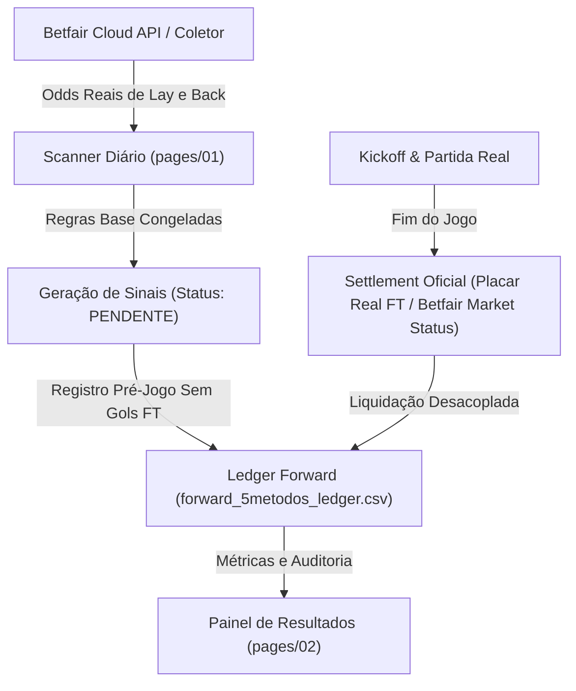

# PRD — SISTEMA ARKAD: Especificação de Engenharia e Portfólio Quantitativo

> **Versão:** 2.1.0 (Auditoria Forense & Reconciliação com Claude)  
> **Autoridade Regulatória:** [GEMINI.md](GEMINI.md) (As 5 Leis Inegociáveis & Hall of Shame)  
> **Status:** Ativo / Em Produção & Forward Paper Trading Puro  
> **Coordenação Multi-Agente:** Antigravity (Gemini) ↔ Claude  

---

## 1. Visão Geral e Missão do Produto

O **ARKAD** é um sistema computacional quantitativo voltado para o mercado de intercâmbio de apostas esportivas (**Betfair Exchange**). Seu objetivo central é a identificação, filtragem, dimensionamento de risco e liquidação automatizada de oportunidades com **Valor Esperado Positivo ($EV > 0$)**, operando majoritariamente no lado do vendedor (**LAY**).

O ARKAD opera sob uma premissa fundamental de engenharia:
> **"Sinal ≠ Edge. Nenhum método é aprovado por backtest histórico ou mineração de dados. A aprovação exige Forward Paper Trading com odds executáveis reais da Betfair Exchange, N estatístico relevante, regras congeladas e auditoria por liquidação oficial."**

---

## 2. Arquitetura de Dados e Ciclo de Vida do Sinal

O fluxo de dados do ARKAD é estritamente desacoplado para eliminar qualquer risco de *look-ahead bias*, contaminação de variáveis ou manipulação de amostra:



### Regras Fundamentais de Execução:
1. **Odds Reais e Executáveis:** É terminantemente proibido utilizar odds de Back ou de casas tradicionais (Bet365) para avaliar operações de Lay. Utiliza-se exclusivamente a coluna `Odd_*_Lay` da Betfair.
2. **Desacoplamento Pré-Jogo vs Pós-Jogo:** A geração diária só grava status `PENDENTE` antes da bola rolar, sem inspecionar gols. A liquidação pós-jogo ocorre em rotina isolada.
3. **Liquidação Oficial:** Métodos de placar exato (Correct Score) e Match Odds são liquidados pelos placares oficiais e/ou pelo status canônico `WINNER/LOSER` devolvido pela API da Betfair, eliminando false-greens de amostragem.
4. **Pureza do Ledger Forward:** O ledger oficial (`forward_5metodos_ledger.csv`) é o único livro-razão de verdade. Nenhum sinal pertencente à regra congelada pode ser dropado ou filtrado na rotina de captura.

---

## 3. Portfólio de Métodos em Produção & Validação

### 3.1. Os 5 Métodos Nucleares Oficiais (Performance Real no Ledger)

Métricas auditadas diretamente no ledger oficial (`forward_5metodos_ledger.csv`, com comissão real Betfair de 5% sobre o green e 1u de risco no red):

| Método | Mercado | Seleção | Regra de Entrada | Faixa de Odd Lay | N Liq. | Win Rate Real | Break-Even WR | P&L Acumulado (u) |
|---|---|---|---|---|---|---|---|---|
| **Lay Draw (Fav $\le$ 1.40)** | Match Odds | The Draw (Empate) | $\min(\text{Odd}_H, \text{Odd}_A) \le 1.40$ | $[4.50, 10.00]$ | 267 | 87.3% (233G/34R) | 86.1% | **+4.42 u** |
| **Lay Home (Fav Fora $\le$ 1.65)** | Match Odds | Home (Mandante) | $\text{Odd}_A \le 1.65$ | $[2.00, 10.00]$ | 129 | 86.8% (112G/17R) | 86.6% | **+0.61 u** |
| **Lay Over 4.5 (Under Pesado)** | Over/Under 4.5 | Over 4.5 Gols | $\text{Odd}_{\text{Under 2.5}} \le 1.50$ | $[4.00, 20.00]$ | 34 | 100.0% (34G/0R) | 95.1% | **+1.76 u** |
| **Lay 2x2 Top 3 (Menor Odd)** | Correct Score | 2 - 2 | TOP 3 menor odd do dia (sem empate hor.) | $[8.00, 20.00]$ | 119 | 96.6% (115G/4R) | 94.5% | **+2.70 u** |
| **Lay 0x3 Top 3 (Super Mandante)** | Correct Score | 0 - 3 | $\text{Odd}_H \le 1.60$, TOP 3 menor odd do dia | $[14.00, 35.00]$ | 87 | 96.6% (84G/3R) | 96.3% | **+0.30 u** |
| **SUBTOTAL 5 MÉTODOS NUCLEARES** | — | — | — | — | **636** | **90.9% (578G/58R)** | **—** | **+9.79 u** |
| *Lay 0x3 (Regra Ampla - Paralelo)* | Correct Score | 0 - 3 | Todos os elegíveis da grade | $[14.00, 35.00]$ | 192 | 96.9% (186G/6R) | 96.3% | *+0.74 u* |
| **TOTAL CONSOLIDADO NO LEDGER** | — | — | — | — | **828** | **92.3% (764G/64R)** | **—** | **+10.53 u** |

> ⚠️ **ALERTA DE CAUDA LONGA — LAY OVER 4.5:**  
> A taxa de acerto de 100% (34/34) em Lay Over 4.5 é a clássica **"100% até o primeiro red"** de eventos raros com odd média de 19.35. No primeiro red inevitável, a perda unitária será de exatas `-1.0u` de liability. Alocar stakes agressivas (ex.: 15%) com base nessa sequência temporária é uma violação gravíssima de risco de ruína.

---

### 3.2. Métodos Zebra de Correct Score: Quarentena Stake-Zero Absoluta

- **Lay 0x2 Zebra** (Mandante Fav $\le 1.45$, Odd Lay $5.0 - 25.0$)
- **Lay 2x0 Zebra** (Visitante Fav $\le 1.45$, Odd Lay $5.0 - 25.0$)

> 🛑 **DIRETRIZ DE RISCO ESTREITA:**  
> O suposto "WR > 97%" das Zebras 0x2 e 2x0 decorre de períodos históricos (Jan–Abr 2026) que continham regimes de odds de Correct Score descontinuados. Esses métodos **NUNCA passaram por forward paper trading isolado**.  
> Em consonância com o Hall of Shame do [GEMINI.md](GEMINI.md) (*"Micro-Edges Travados por Liquidez"*), as Zebras operam **exclusivamente em observação com `stake: 0.0`**. **Nenhum capital real pode ser alocado** a eles até cumprirem o protocolo completo de $N \ge 300$ jogos no paper forward.

---

## 4. Auditoria Forense da Blacklist de Ligas: O Veredito da Permutação

Uma análise preliminar dos reds de Agosto/Setembro apontou que Holanda 1 (Eredivisie) e Suécia 1 (Allsvenskan) concentravam 5 reds no Lay Draw. No entanto, uma auditoria rigorosa com testes de hipótese descartou a causalidade dessa observação:

### O Teste de Permutação (Claude Opus):
1. **Forward do Lay Draw (N=267 liquidados em 65 ligas):**
   - Excluir as 2 piores ligas da amostra geraria um ganho aparente de `+4.18u`.
   - **Controle Estatístico:** Ao embaralhar aleatoriamente os resultados entre as 65 ligas por 5.000 vezes (hipótese nula de efeito nulo por liga), a remoção das 2 piores ligas em cada iteração gerou uma mediana de ganho de **`+4.16u`**, com probabilidade $P(\ge \text{observado}) = 0.49$.
   - **Conclusão Científica:** Em qualquer amostra de 65 categorias, as 2 piores apresentarão concentração de reds por pura variância. Cortá-las post-hoc é **Garden of Forking Paths / Data Dredging**.
2. **Backtest Histórico Pré-Forward (N=3.326 jogos até 31/07):**
   - Holanda 1 foi a 12ª pior e Suécia 1 a 8ª pior de 39 ligas. 22 das 39 ligas operaram abaixo do break-even. Em 2024, ambas foram positivas (+2.5% e +8.1%). O descasamento não é uma anomalia estrutural crônica, mas flutuação normal de cauda.
3. **Decisão de Engenharia:**
   - **Preservação da Regra Congelada:** A exclusão hardcoded de ligas foi **completamente removida** do coletor forward (`relatorio_forward_5metodos.py`) e dos módulos operacionais. O portfólio oficial mede estritamente a **Regra Base Congelada**, sem contaminação por overfitting retrospectivo.

---

## 5. Gestão de Capital e Engenharia de Sizing

A alocação de banca opera sobre o **Capital em Risco (Liability)**, com métricas reais ancoradas no ledger oficial:

### 5.1. Fórmulas Oficiais (Comissão Betfair 5%)
- **Liability Fixa por Entrada:** $\text{Liability} = \text{Banca} \times \%_{\text{Risco}}$
- **Lucro Líquido no GREEN:**
  $$\text{P\&L}_{\text{Green}} = +\frac{0.95 \times \text{Liability}}{\text{Odd}_{\text{Lay}} - 1}$$
- **Prejuízo Líquido no RED:**
  $$\text{P\&L}_{\text{Red}} = -\text{Liability} = -1.0 \text{ u (em termos de risco)}$$
- **Break-Even Win Rate:**
  $$\text{WR}_{\text{BE}} = \frac{\text{Odd}_{\text{Lay}} - 1}{\text{Odd}_{\text{Lay}} - 0.05}$$

### 5.2. Alocação Prudente por Categoria (Banca Referência: R$ 2.000)

| Categoria | Métodos | % Liability Recomendada | Risco por Entrada | Racional de Risco |
|---|---|---|---|---|
| **Core (Liquidez & Frequência)** | Lay Draw, Lay Home | **5.0%** | R$ 100,00 | Odds médias moderadas (~6.9 a 7.2). Sharpe equilibrado. |
| **Defensivo de Alta Odd** | Lay Over 4.5 | **Máximo 5.0%** | R$ 100,00 | Odd média 19.35. Proibido alavancar acima de 5% pelo risco de cauda do 1º red. |
| **CS Top 3 (Seletivo)** | Lay 2x2, Lay 0x3 | **5.0%** | R$ 100,00 | Odd média 17.4 a 25.7. 5% de liability trava a perda máxima em R$ 100 por red. |
| **Zebra em Observação** | Lay 0x2, Lay 2x0 | **0.0% (Stake-Zero)** | R$ 0,00 | **Sem dinheiro real.** Quarentena ativa de forward. |

### 5.3. Circuit Breakers Obrigatórios
- **Daily Stop Loss:** Perda diária acumulada de $15\%$ da banca trava novas entradas no dia.
- **Circuit Breaker de Método:** 2 REDs no mesmo método dentro do mesmo dia pausam o método até o dia seguinte.
- **Teto de Exposição Concorrente:** O somatório de liabilities abertas simultaneamente não deve exceder $25\%$ da banca.

---

## 6. Protocolo de Garantia de Qualidade (Verification Before Completion)

Todo ciclo de desenvolvimento e deploy segue obrigatoriamente as 4 etapas:

1. **Compilação e Sintaxe:**
   ```bash
   python -m py_compile pages/*.py *.py
   ```
2. **Integridade de Dados e Lealdade ao Ledger:**
   - Auditorias financeiras devem ser rodadas **exclusivamente sobre o ledger oficial** (`metodos_aprovados/forward_5metodos_ledger.csv`). Proibido misturar planilhas de backtest ou relatórios transitórios.
3. **Auditoria Git:**
   - Verificação limpa de `git status` e `git diff` antes de commits.
4. **Sincronização Multi-Agente:**
   - Atualização mandatória do [worklog.md](worklog.md) (append-only no topo).
   - Atualização do [tasks.md](tasks.md).

---

## 7. Histórico de Versões
- **v2.1.0 (2026-09-14):** Reversão da exclusão de Holanda/Suécia após teste de permutação ($p=0.49$), conciliação oficial dos números do ledger (828 liq, 636 oficiais, +9.79u) e reclassificação de Zebras para stake-zero estrito.
- **v2.0.0 (2026-09-14):** Criação inicial do PRD.
