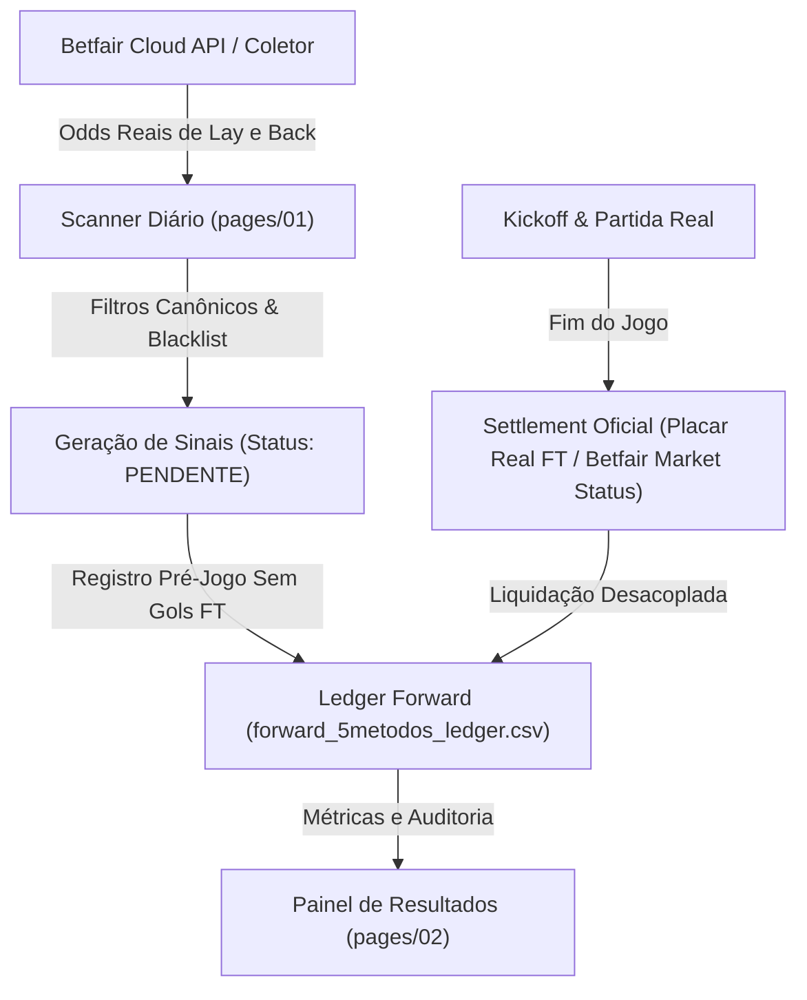

# PRD — SISTEMA ARKAD: Especificação de Engenharia e Portfólio Quantitativo

> **Versão:** 2.0.0 (Sincronizada com GEMINI.md, tasks.md e worklog.md)  
> **Autoridade Regulatória:** [GEMINI.md](GEMINI.md) (As 5 Leis Inegociáveis & Hall of Shame)  
> **Status:** Ativo / Em Produção & Forward Paper Trading  
> **Coordenação Multi-Agente:** Antigravity (Gemini) ↔ Claude  

---

## 1. Visão Geral e Missão do Produto

O **ARKAD** é um sistema computacional quantitativo voltado para o mercado de intercâmbio de apostas esportivas (**Betfair Exchange**). Seu objetivo central é a identificação, filtragem, dimensionamento de risco e liquidação automatizada de oportunidades com **Valor Esperado Positivo ($EV > 0$)**, operando majoritariamente no lado do vendedor (**LAY**).

O ARKAD opera sob uma premissa fundamental de engenharia:
> **"Sinal ≠ Edge. Nenhum método é aprovado por backtest histórico ou mineração de dados. A aprovação exige Forward Paper Trading com odds executáveis reais da Betfair Exchange, N estatístico relevante e auditoria por liquidação oficial."**

---

## 2. Arquitetura de Dados e Ciclo de Vida do Sinal

O fluxo de dados do ARKAD é estritamente desacoplado para eliminar qualquer risco de *look-ahead bias* ou contaminação de variáveis:



### Regras Fundamentais de Execução:
1. **Odds Reais e Executáveis:** É terminantemente proibido utilizar odds de Back ou de casas tradicionais (Bet365) para avaliar operações de Lay. Utiliza-se exclusivamente a coluna `Odd_*_Lay` da Betfair.
2. **Desacoplamento Pré-Jogo vs Pós-Jogo:** A geração diária só grava status `PENDENTE` antes da bola rolar, sem inspecionar gols. A liquidação pós-jogo ocorre em rotina isolada.
3. **Liquidação Oficial:** Métodos de placar exato (Correct Score) e Match Odds são liquidados pelos placares oficiais e/ou pelo status canônico `WINNER/LOSER` devolvido pela API da Betfair, eliminando false-greens de amostragem.

---

## 3. Portfólio de Métodos Aprovados & Ativos

O portfólio oficial divide-se em **5 Métodos Nucleares** e **2 Métodos de Micro-Liability (Zebra)**.

### 3.1. Os 5 Métodos Nucleares

| Método | Mercado | Seleção | Regra de Entrada | Faixa de Odd Lay | Break-Even WR | Papel no Portfólio |
|---|---|---|---|---|---|---|
| **Lay Draw (Fav $\le$ 1.40)** | Match Odds | The Draw (Empate) | $\min(\text{Odd}_H, \text{Odd}_A) \le 1.40$ | $[4.50, 10.00]$ | $81.9\% - 90.4\%$ | **Motor Central (Maior Volume e Sharpe)** |
| **Lay Home (Fav Fora $\le$ 1.65)** | Match Odds | Home (Mandante) | $\text{Odd}_A \le 1.65$ | $[2.00, 10.00]$ | $51.3\% - 90.4\%$ | **Maior ROI Unitário / Volatilidade Moderada** |
| **Lay Over 4.5 (Under Pesado)** | Over/Under 4.5 | Over 4.5 Gols | $\text{Odd}_{\text{Under 2.5}} \le 1.50$ | $[4.00, 20.00]$ | $75.9\% - 95.2\%$ | **Proteção Defensiva / Alta Taxa de Acerto** |
| **Lay 2x2 Top 3 (Menor Odd)** | Correct Score | 2 - 2 | TOP 3 menor odd do dia (sem empate hor.) | $[8.00, 20.00]$ | $88.0\% - 95.2\%$ | **Placar Raro com Risco Condensado** |
| **Lay 0x3 Top 3 (Super Mandante)** | Correct Score | 0 - 3 | $\text{Odd}_H \le 1.60$, TOP 3 menor odd do dia | $[14.00, 35.00]$ | $93.2\% - 97.3\%$ | **Anti-Goleada Visitante em Super Favorito** |

### 3.2. Os 2 Métodos Zebra de Micro-Liability

| Método | Mercado | Seleção | Regra de Entrada | Faixa de Odd Lay | Dimensionamento de Risco |
|---|---|---|---|---|---|
| **Lay 0x2 Zebra** | Correct Score | 0 - 2 | Mandante Fav $\le 1.45$ | $[5.00, 25.00]$ | **Micro-Liability Fixa: R$ 25 a R$ 50** |
| **Lay 2x0 Zebra** | Correct Score | 2 - 0 | Visitante Fav $\le 1.45$ | $[5.00, 25.00]$ | **Micro-Liability Fixa: R$ 25 a R$ 50** |

*Nota:* Os métodos Zebra possuem excelente taxa de acerto histórica ($>97\%$), porém contam com liquidez reduzida e risco de cauda caso ocorra zebra precoce. Por isso, a regra estrita é operar com **Micro-Liability**, sem alavancagem de banca.

---

## 4. Blacklist Oficial de Ligas (Exclusão Sistemática)

Após auditoria quantitativa nos 561 jogos do ledger forward (Ago/Set 2026) e backtest histórico de 2024–2026, identificou-se que determinadas ligas possuem perfil estruturalmente adverso para operações de Lay Draw e Correct Score (alta taxa de gols tardios, zebras frequentes e overround alargado).

### Ligas Permanentemente Bloqueadas em Todos os Filtros:
1. **Holanda 1 (`NETHERLANDS 1` / `EREDIVISIE`):**
   - *Diagnóstico Empírico:* 5 reds em Ago/Set (-4.03u). No histórico consolidado 2024-2026, apresenta WR de 81,6% vs Break-even exigido de 86,4% (-5.87u de perda crônica).
   - *Causa Física:* Futebol ultrarotativo, transições abertas e alta frequência de empates tardios em favoritos (2-2, 3-3).
2. **Suécia 1 (`SWEDEN 1` / `ALLSVENSKAN`):**
   - *Diagnóstico Empírico:* 3 reds em Ago/Set (-1.18u). No histórico, WR de 79,4% vs Break-even de 85,4% (-2.37u).
3. **Ligas de Risco Estrutural e Iliquidez:**
   - `SERBIA 1` / `SUPERLIGA`
   - `IRELAND 1` / `PREMIER DIVISION`
   - `TURKEY 1` / `SUPER LIG`
   - `SCOTLAND 2`, `SCOTLAND 3`, `SCOTLAND 4`

> **Impacto Quantitativo Comprovado:** A remoção de Holanda 1 e Suécia 1 evitou **8 reds (-5.21u / R$ 654,48 salvos)** e elevou o retorno simulado do período de +95.7% para **+128.4%**.

---

## 5. Gestão de Capital e Engenharia de Sizing

A sustentabilidade no longo prazo na Betfair Exchange depende de dimensionamento sobre o **Capital em Risco (Liability)**, nunca sobre a stake nominal de 1 unidade.

### 5.1. Fórmulas Oficiais (Comissão Real de 5% da Betfair)
- **Liability (Risco):**
  $$\text{Liability} = \text{Stake} \times (\text{Odd}_{\text{Lay}} - 1)$$
- **Lucro Líquido no GREEN:**
  $$\text{P\&L}_{\text{Green}} = \text{Stake} \times (1 - 0.05) = +0.95 \times \text{Stake} = +\frac{0.95 \times \text{Liability}}{\text{Odd}_{\text{Lay}} - 1}$$
- **Prejuízo no RED:**
  $$\text{P\&L}_{\text{Red}} = -\text{Liability} = -1.0 \text{ u (em termos de risco)}$$
- **Break-Even Win Rate:**
  $$\text{WR}_{\text{BE}} = \frac{\text{Odd}_{\text{Lay}} - 1}{\text{Odd}_{\text{Lay}} - 0.05}$$

### 5.2. Alocação Dinâmica de Liability (Banca Referência: R$ 2.000)

| Categoria | Métodos | % Liability da Banca | Valor Típico (Banca R$ 2.000) | Racional Quantitativo |
|---|---|---|---|---|
| **Core (Alta Liquidez & Frequência)** | Lay Draw, Lay Home | **5.0%** | R$ 100,00 | Odd média 5.0 - 7.5. Baixo impacto por red unitário; maior resiliência de Sharpe. |
| **Defensivo / Cauda Longa** | Lay Over 4.5 | **5.0% a 7.5%** | R$ 100,00 a R$ 150,00 | Odds altas (~19.0). Lucro unitário pequeno (+0.05u), mas WR de 100% no forward. 15% de risco geraria dano desproporcional no 1º red. |
| **CS Seletivo (Top 3)** | Lay 2x2, Lay 0x3 | **5.0%** | R$ 100,00 | Odds de 14.0 a 30.0. Red unitário consome 1u de risco. Manter em 5% evita drawdowns acumulados. |
| **Micro-Zebra** | Lay 0x2 Zebra, Lay 2x0 Zebra | **Fixo (1.2% a 2.5%)** | **R$ 25,00 a R$ 50,00** | Baixa liquidez da Betfair em CS de zebra. Trava de segurança patrimonial. |

### 5.3. Circuit Breakers e Travas de Risco
- **Daily Stop Loss:** Perda diária acumulada de $15\%$ da banca congela todas as entradas subsequentes no dia.
- **Circuit Breaker por Método:** Caso um método específico sofra 2 REDs no mesmo dia, todas as entradas pendentes daquele método no dia são abortadas.
- **Teto Máximo de Exposição Simultânea:** O somatório de liabilities abertas em jogos simultâneos não deve ultrapassar $25\%$ da banca.

---

## 6. Protocolo de Garantia de Qualidade (Verification Before Completion)

Adotando as melhores práticas de engenharia de software e modelos quantitativos, todo ciclo de alteração no sistema deve cumprir os 4 passos de verificação antes de qualquer deploy:

1. **Verificação de Compilação e Sintaxe:**
   ```bash
   python -m py_compile pages/*.py *.py
   ```
2. **Auditoria de Integridade de Dados:**
   - Nenhum valor ausente (`NaN`) pode ser imputado como `0.0` ou médias sintéticas.
   - Todo registro novo no ledger forward deve conter colunas obrigatórias: `Data, Hora, Liga, Jogo, Metodo, Mercado, Tipo, Odd_Executada, Liability, Status, PnL_u`.
3. **Verificação Git Limpa:**
   - Conferência de `git status` e `git diff` antes de submeter alterações.
4. **Sincronização da Memória Multi-Agente:**
   - Atualização mandatória do [worklog.md](worklog.md) (append-only no topo).
   - Atualização do [tasks.md](tasks.md).

---

## 7. Registro de Versões e Próximos Passos
- **2026-09-14 (v2.0.0):** Consolidação do PRD, inclusão formal das Zebras 0x2/2x0, isolamento definitivo da blacklist Holanda/Suécia e calibração de gestão de banca em 5% liability.
- **Roadmap:** Continuação do tracking do Lay 0x0 XGBoost no forward paralelo com verificação de CLV (Closing Line Value).
